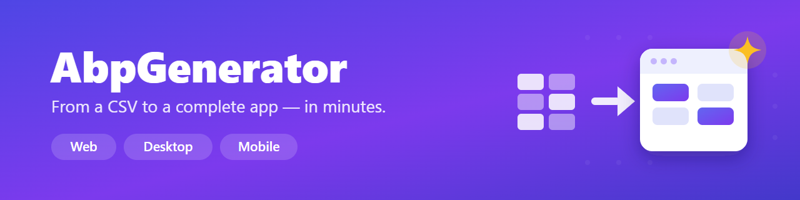
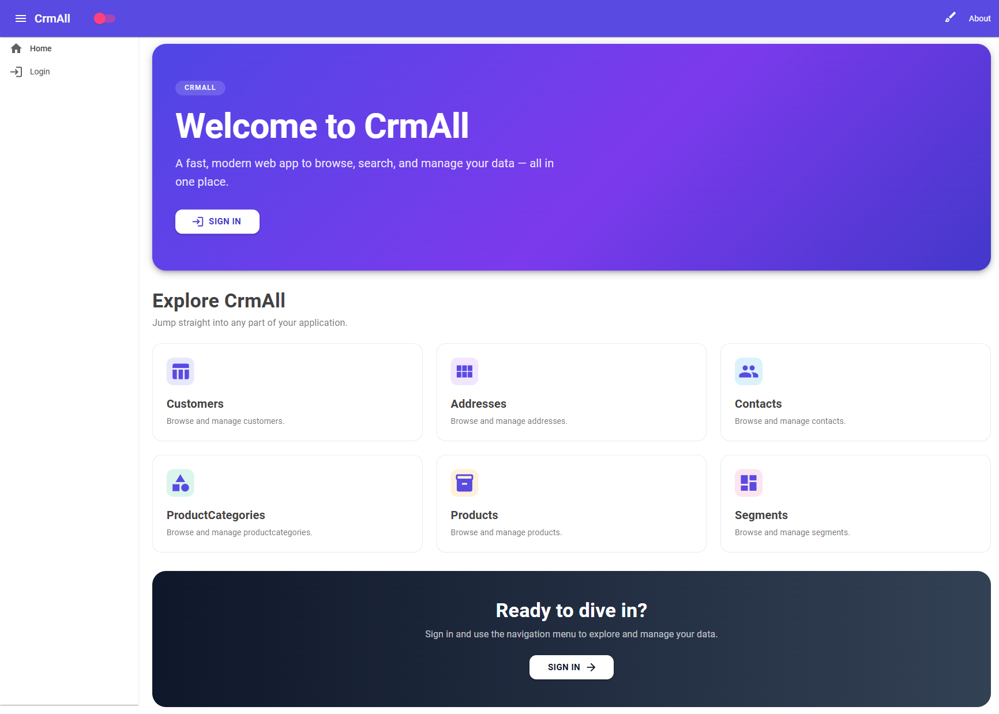
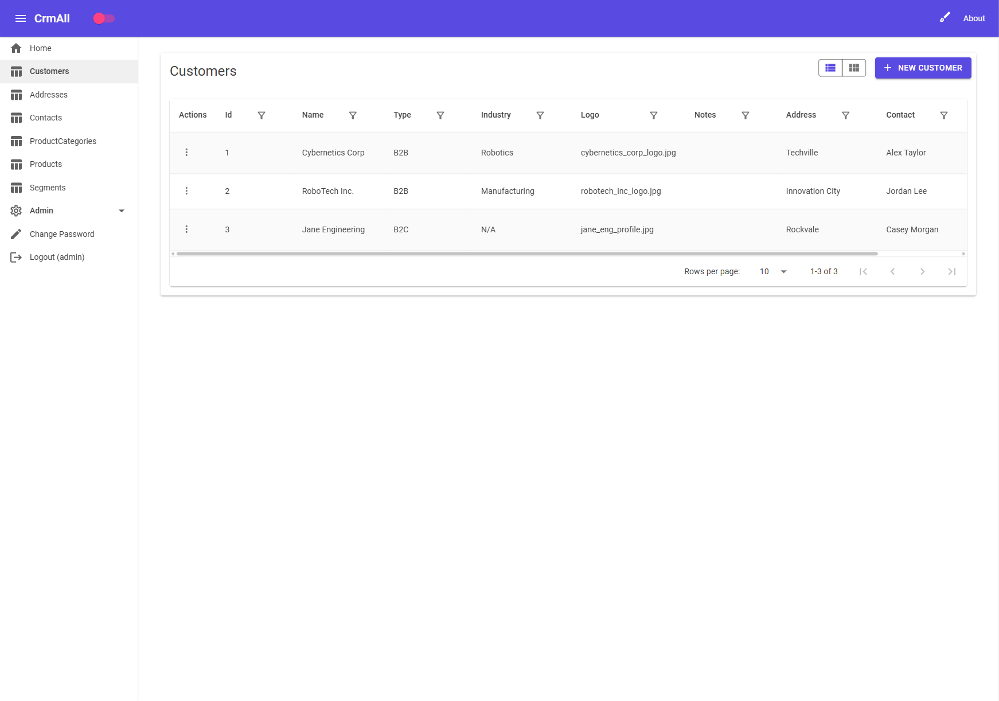
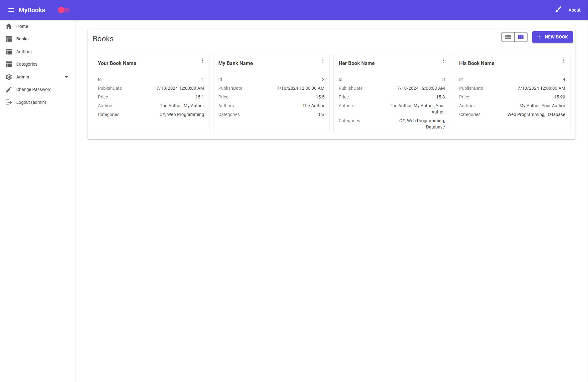

  

  
  
  
  
  
  

<h1 align="center">From a CSV to a complete app — in minutes.</h1>

  <b>AbpGenerator</b> turns plain CSV files into a polished, full-stack, multi-platform business app on
  <a href="https://abp.io">ABP Framework</a> + <a href="https://mudblazor.com">MudBlazor</a> —
  with authentication, admin, a modern UI, and every common module already wired together.
   You own the full source. 100% free to ship.

  <a href="https://ask2app.com/abpGenerator"><b>▶ See it in action & grab the latest samples →</b></a>

---

## ✨ What you get out of the box

Every generated app is a complete, coherent product — not a scaffold you have to finish.

- 🎨 **A gorgeous, modern UI** — clean MudBlazor design, colored app bar, light/dark mode, live theme-color picker, an auto-generated home page, and list screens with sorting, filtering, paging, and a one-click **Grid ⇄ Cards** toggle that remembers your choice per screen.
- 🔗 **Relationships that just work** — **one-to-one**, **one-to-many**, and **many-to-many**, auto-detected from your data and rendered in grids, cards, and edit forms (multi-select for many-to-many).
- 🧩 **Batteries included by default** — Identity & roles, OpenIddict login, permissions, settings, feature flags, multi-tenancy / SaaS, audit logging, background jobs, file/blob storage, and **CMS Kit** (tags, comments, ratings, blogs, pages, menus).
- 📱 **One app, every screen** — a Blazor WebAssembly client, a native **.NET MAUI** desktop & mobile app (Windows / Android / iOS / macOS), and a full web admin host — all sharing the same UI.
- 🚀 **Run it instantly** — demo data is seeded for you, so the app is alive on first launch.
- 📦 **Yours to keep** — built entirely on free, open-source components (LGPL / MIT). Ship it, sell it, open-source it.

---

## 📸 A peek at the output

  
   <i>Auto-generated home page — one card per module in your app.</i>

  
  
   <i>Grid view (with one-to-one, one-to-many & many-to-many columns) and the one-click Cards view.</i>

---

## 🧱 What can you build with it?

If it fits in a spreadsheet, you can generate an app for it:

**CRMs & sales pipelines** · **Product catalogs & stores** · **Back-office & admin tools** ·
**Multi-tenant SaaS products** · **Internal line-of-business apps** · **Inventory & operations**

From a handful of CSV files you can have a **15-entity, multi-relationship, multi-module, multi-platform**
app running and seeded — the kind of thing that normally takes a team weeks.

---

<h3 align="center">Stop scaffolding. Start shipping.</h3>

  Minutes, not weeks. Real architecture. A modern UI everywhere. Free and fully yours.
    
  <a href="https://ask2app.com/abpGenerator"><b>Get AbpGenerator → ask2app.com/abpGenerator</b></a>

Built with ❤️ on ABP Framework + MudBlazor.

